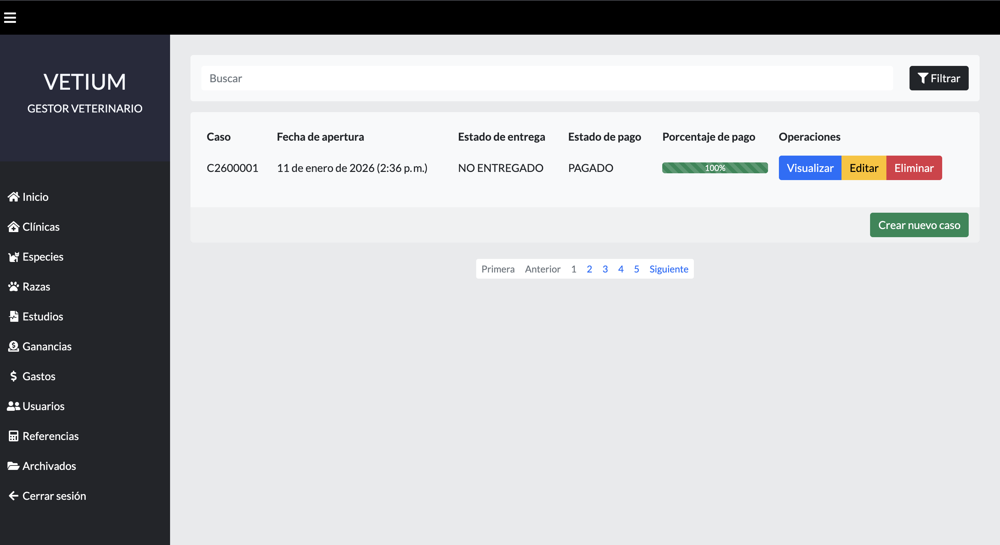
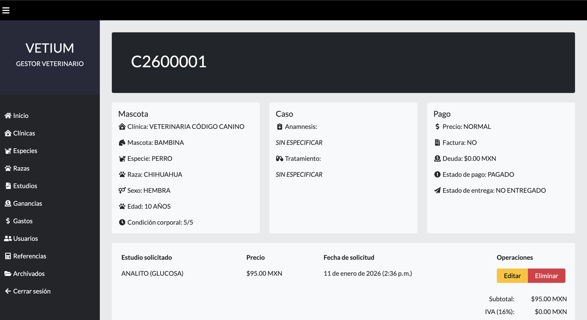
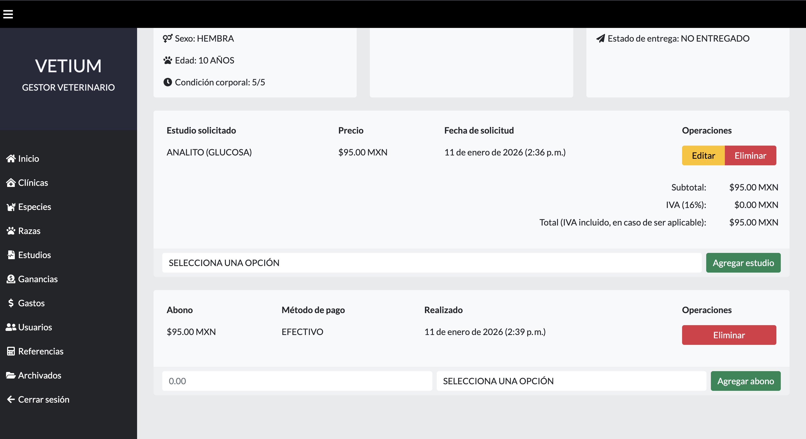
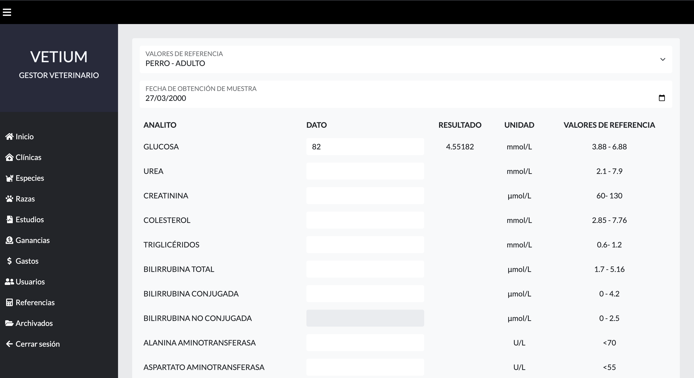
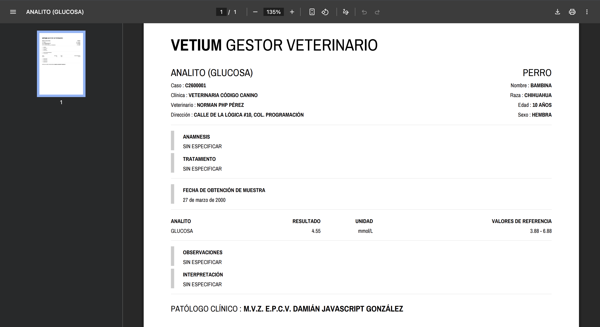

# VETIUM: UN SISTEMA GESTOR DE CASOS CLÍNICO-VETERINARIOS

**VETIUM** es una aplicación web orientada a la gestión general de casos clínico-veterinarios. El objetivo principal de este sistema es facilitar la gestión y emisión de resultados de estudios de laboratorio .

## Características

- **Panel de administración de casos**
	- Registro de datos tanto del paciente (nombre, especie, raza, edad, sexo, etcétera) como los del solicitante (nombre, apellidos, número de teléfono, clínica de procedencia, etcétera).
- **Generación automática de resultados de estudios de laboratorio**
	- Emisión de resultados de estudios de laboratorio en formato PDF.
	- Más de 10 tipos de resultados de estudios de laboratorio, incluyendo bioquímicas, hemográmas, urianalisis, etcétera.
- **Bitácora de egresos e ingresos**
	- Control de pagos por caso clínico
	- Sección dedicada a egresos de la clínica

 ## Galería

| Dashboard | Resumen de caso | Control de pagos |
| :---: | :---: | :---: |
|  |  |  |

| Interpretación de resultados | Emisión de resultados |
| :---: | :---: |
|  |  |

## Tecnologías

- **Lenguaje Principal de Programación:** PHP 8.5.1
- **Sistema Gestor de Base de Datos:** MySQL 9.5.0
- **Librerías:** DOMPDF 3.1.4

## Credenciales

- **Usuario:** root
- **Contraseña:** root
